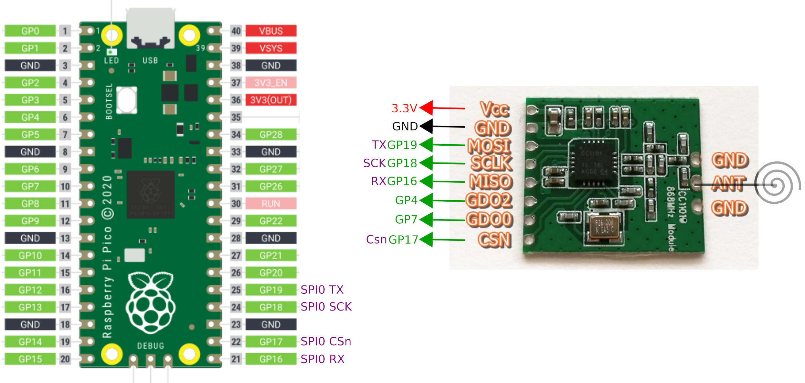

# esp-arduino-nfs32002

Réimplémentation en C++ pour ESP et Arduino du protocole NF S 32-002 utilisé par les balises sonores des feux piétons. Permet de détecter le signal d'une télécommande à partir d'un module radio CC1101.

Le module utilise la bibliothèque [CC1101-ESP-Arduino](https://github.com/wladimir-computin/CC1101-ESP-Arduino) et fonctionne pour ESP8266 / ESP32 / Arduino.

Fichier `Arduino DetectFrame.ino` testé sur Raspberry Pico avec Arduino IDE ; bibliothèque à tester.

## Exemple d'utilisation avec un Raspberry Pico :

```c++
#include <ESP_Arduino_CC1101_NFS32002.h>

const int SPI_SCK = 18; 			//board or mcu specific
const int SPI_MISO = 16; 			//board or mcu specific
const int SPI_MOSI = 19; 			//board or mcu specific
const int SPI_CS = 17;
const int RADIO_INPUT_PIN = 7;
const int RADIO_OUTPUT_PIN = 4;

// Créer une fonction qui sera appelée lors de la détection d'une télécommande
void detect(){
  Serial.println("Ouistici !");
}

void setup(){
  Serial.begin(9600);
  
  // Initialiser le module radio
  CC1101_NFS32002 radio(SPI_SCK, SPI_MISO, SPI_MOSI, SPI_CS, RADIO_INPUT_PIN, RADIO_OUTPUT_PIN);
  
  // Appeler la méthode startDetection en lui indiquant en paramètre la fonction à appeler lors de la détection
  startDetection(detect);
}


void loop(){

}

```
Câblage correspondant :


